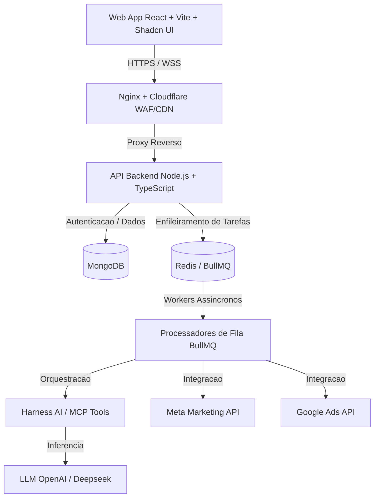

# Arquitetura Geral do Sistema — Valeriun App

Este documento detalha a arquitetura técnica, fluxo de dados e orquestração do ecossistema Valeriun.

---

## 1. Visão Geral e Proposta de Valor

O Valeriun é uma plataforma centralizada para criação, gestão e otimização de campanhas de anúncios nas redes **Meta Ads** e **Google Ads**, focada em experiência mobile-first e automação via Inteligência Artificial.

- **Gestão Centralizada**: Meta Ads e Google Ads com suporte a múltiplas contas.
- **Mobile-First**: Criação e gestão de anúncios diretamente pelo smartphone sem depender de desktop.
- **Comando por Voz e Texto**: O usuário expressa o objetivo de anúncio em linguagem natural e o agente de IA transforma em campanha estruturada.
- **Eficiência Operacional**: Eliminação de processos manuais, consolidação de métricas em tempo real e publicação assistida.

---

## 2. Camadas do Sistema

---

## 3. Módulos Principais

### 3.1 Front-End (Web App)
- **Framework**: React 19 + TypeScript + Vite.
- **Design System**: Shadcn UI + Tailwind CSS v4.
- **Padrão de Comunicação**: REST API para consultas síncronas e WebSocket (Socket.io) para atualizações em tempo real (proibido o uso de polling).

### 3.2 Back-End (API & Worker Engine)
- **Runtime**: Node.js com TypeScript.
- **Persistência de Dados**: MongoDB (Mongoose com schemas estritos e validação rigorosa).
- **Processamento Assíncrono**: BullMQ sobre Redis para filas distribuídas:
  - Controle de rate limit para Meta API e Google Ads API.
  - Processamento e geração assíncrona de criativos com LLM.
  - Sincronização periódica de métricas e relatórios.
  - Retentativas automáticas (exponential backoff) com idempotência.

### 3.3 IA & Orquestração
- **Modelos (LLM)**: OpenAI e DeepSeek.
- **Agente Harness**: Planejamento, quebra de tarefas e execução orientada a ferramentas.
- **MCP (Model Context Protocol)**: Integração padronizada entre agentes, contexto de contas e ferramentas de publicação.
- **Fluxo do Anúncio**: Comando do usuário -> Variações e Testes A/B -> Definição de Públicos -> Revisão -> Aprovação -> Publicação.

### 3.4 Relatórios e Métricas
- Consolidação e cálculo de métricas essenciais:
  - Investimento, Cliques, Conversões.
  - CPC (Custo por Clique), CPM (Custo por Mil Impressões).
  - CPA (Custo por Aquisição), ROAS (Retorno sobre Gasto em Anúncios).
  - Comparativo dinâmico de períodos.

---

## 4. Infraestrutura e Escala Horizontal

- **Containers**: Docker para padronização de ambientes de desenvolvimento, staging e produção.
- **Servidores**: VPS com balanceamento de carga via Nginx e proteção Cloudflare (WAF, SSL, mitigação DDoS).
- **Observabilidade**: Logs estruturados, Sentry para captura de erros e Grafana para telemetria.
